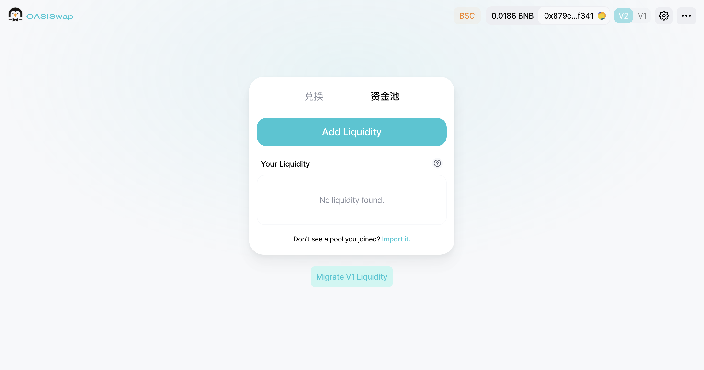
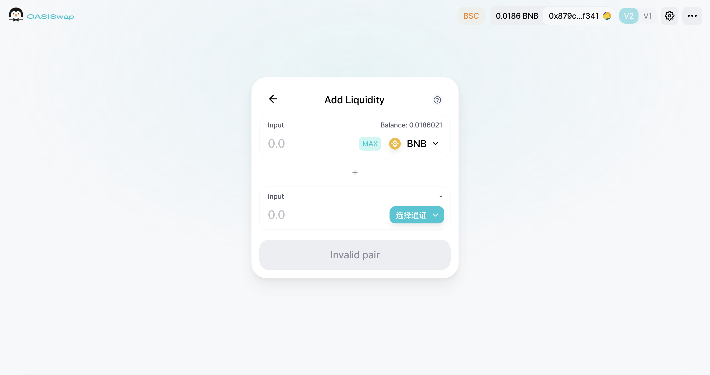
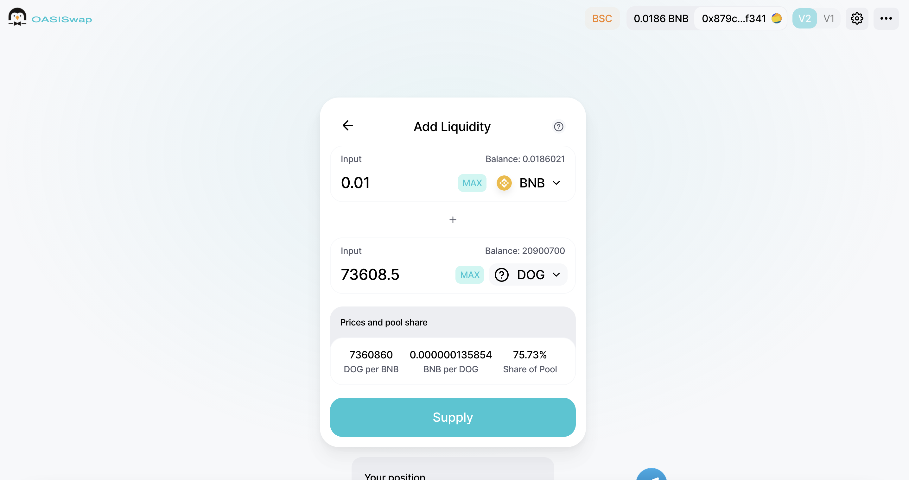
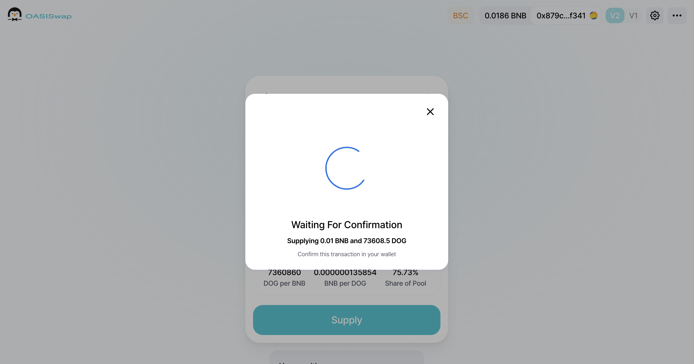
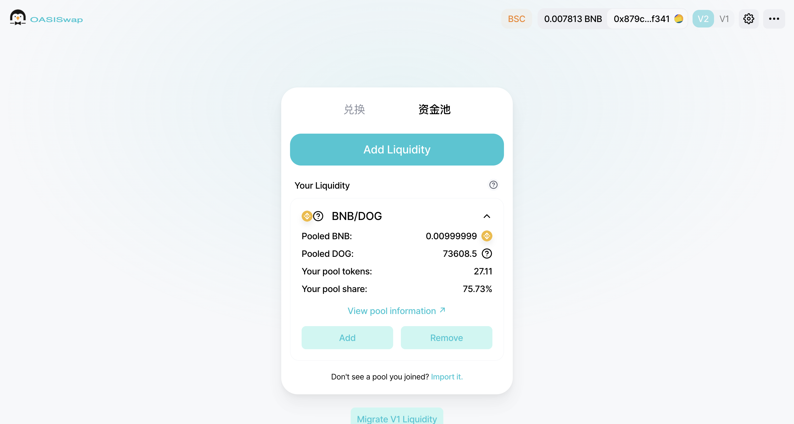
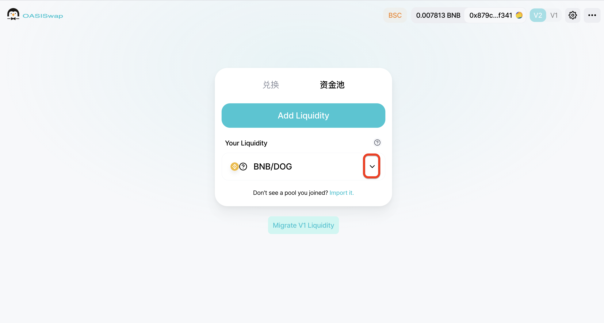
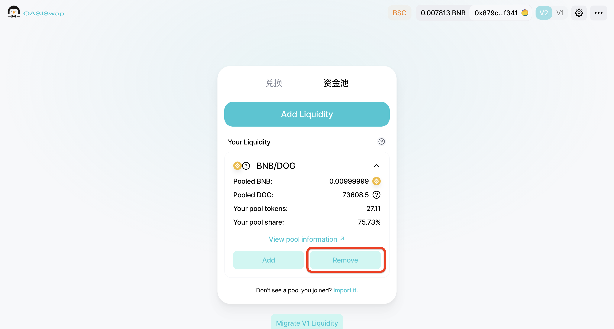
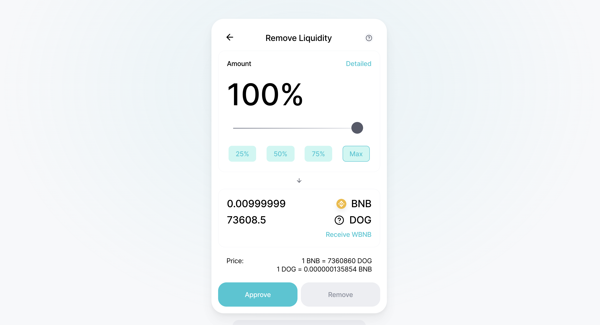
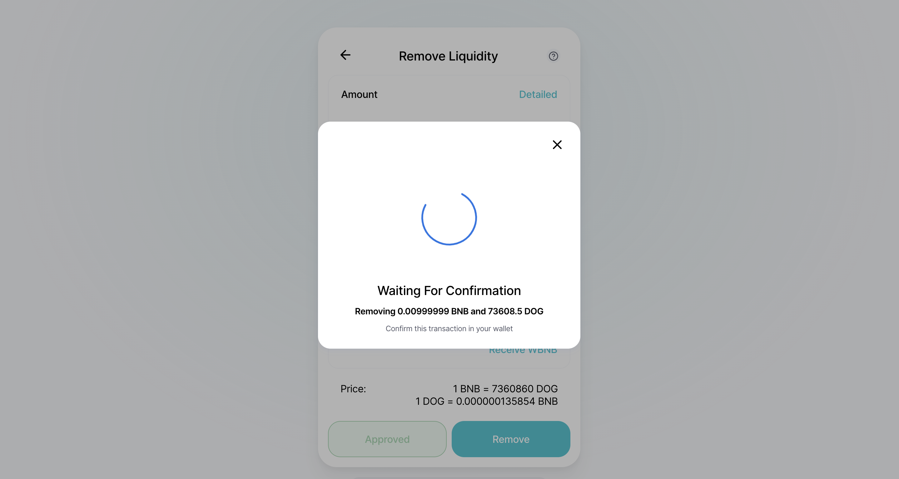

# How to Add/Remove Liquidity 

&nbsp;
 

 
   
 
    
 
     <h2 class="blockHeadingContent-756c9114">Add Liquidity</h2> 
     
Go to the <strong class="bold-3c254bd9" data-slate-leaf="true">Pool</strong> page and click <strong class="bold-3c254bd9" data-slate-leaf="true">Add Liquidity</strong>.
 
     
 
      
 
       <figure class="reset-3c756112--figure-c0d4b308" contenteditable="false" data-key="c0c8d1c2c4a74b549f6edecf440ebb8e"> 
        
 
         

          
         
 
        
 
        

         &nbsp;
        
 
       </figure> 
      
 
     
 
     
&nbsp;Enter the two passes you want to add liquidity to, enter the corresponding quantity, and click <strong class="bold-3c254bd9" data-slate-leaf="true">Add</strong>.
 
     
 
      
 
       <figure class="reset-3c756112--figure-c0d4b308" contenteditable="false" data-key="02898e48721743a396c50b4f5cee5932"> 
        
 
         

          
         
 
        
 
        

         &nbsp;
        
 
       </figure> 
      
 
     
 
     
Click <strong class="bold-3c254bd9" data-slate-leaf="true">Confirm Supply</strong>.
 
     
 
      
 
       <figure class="reset-3c756112--figure-c0d4b308" contenteditable="false" data-key="673e72bcc7474e5b9f22a0a50f305eed"> 
        
 
         

          
         
 
        
 
        

         &nbsp;
        
 
       </figure> 
      
 
     
 
     
Click <strong class="bold-3c254bd9" data-slate-leaf="true">Confirm</strong> in the MetaMask Wallet window<strong class="bold-3c254bd9" data-slate-leaf="true">.</strong>
 
     
 
      
 
       <figure class="reset-3c756112--figure-c0d4b308" contenteditable="false" data-key="db7e7bcc08ee4975a5540fea2108c334"> 
        
 
         

          
         
 
        
 
        

         &nbsp;
        
 
       </figure> 
      
 
     
 
     
<strong>Wait for</strong> the liquidity to be added after the delivery contract interaction.
 
     
 
      
 
       <figure class="reset-3c756112--figure-c0d4b308" contenteditable="false" data-key="c9cce26ec3694e8782f0b08b406fda22"> 
        
 
         

          
         
 
        
 
        

         &nbsp;
        
 
       </figure> 
      
 
     
 
     <h2 class="blockHeadingContent-756c9114">Remove Liquidity</h2> 
     
Click <strong class="bold-3c254bd9" data-slate-leaf="true">Manage</strong> to the right of the mobility you want to remove and expand the details.
 
     
 
      
 
       <figure class="reset-3c756112--figure-c0d4b308" contenteditable="false" data-key="426264e2bbd74bf992ce3470ded81161"> 
        
 
         

          
         
 
        
 
        

         &nbsp;
        
 
       </figure> 
      
 
     
 
     
Click <strong class="bold-3c254bd9" data-slate-leaf="true">Remove</strong>.
 
     
 
      
 
       <figure class="reset-3c756112--figure-c0d4b308" contenteditable="false" data-key="c3adbced24e14886822e56462cdc26c8"> 
        
 
         

          
         
 
        
 
        

         &nbsp;
        
 
       </figure> 
      
 
     
 
     
Enter the number to be removed and click <strong class="bold-3c254bd9" data-slate-leaf="true">Approve</strong> &amp; <strong class="bold-3c254bd9" data-slate-leaf="true">Remove</strong>.
 
     
 
      
 
       <figure class="reset-3c756112--figure-c0d4b308" contenteditable="false" data-key="a0ef02bd02b344e5a0d6c067388ba52c"> 
        
 
         

          
         
 
        
 
        

         &nbsp;
        
 
       </figure> 
      
 
     
 
     
Click <strong class="bold-3c254bd9" data-slate-leaf="true">Confirm</strong> in the MetaMask Wallet window<strong class="bold-3c254bd9" data-slate-leaf="true">.</strong>
 
     
 
      
 
       <figure class="reset-3c756112--figure-c0d4b308" contenteditable="false" data-key="40442eb8a2254ab9b43baf9653537db3"> 
        
 
         

          
         
 
        
 
        

         &nbsp;
        
 
       </figure> 
      
 
     
 
     
Wait for the contract to interact before liquidity removal is complete.
 
     
&nbsp;
 
     <h2 class="blockParagraph-544a408c" data-key="ef4ced9447ad44fe85230c30ed4eed5f"><strong>Congratulations! </strong></h2> 
     
<strong>Anyone that provide Liquidity for OST/USDT or OST/BNB will receive some OST token Airdrop&amp;Rewards!</strong>
 
    
 
   
 

