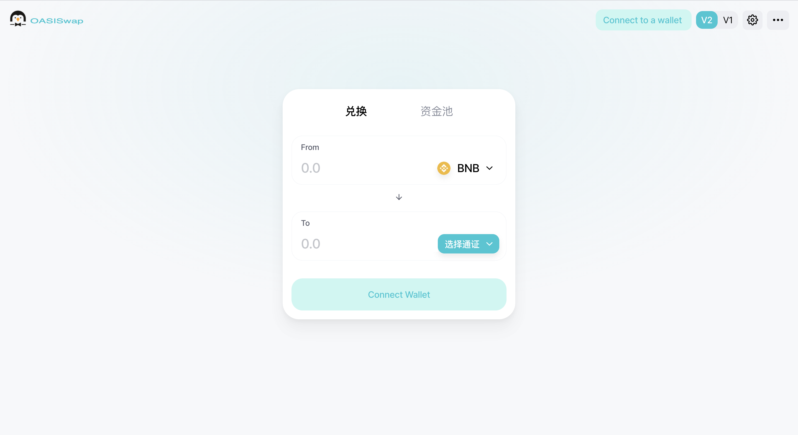
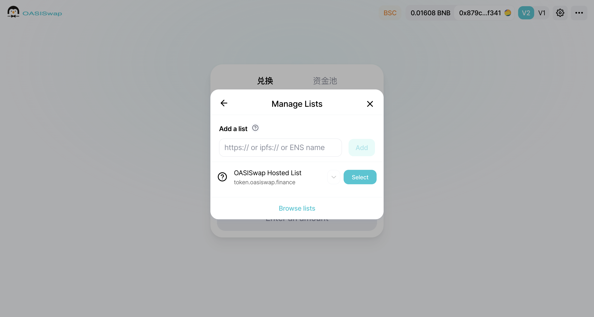
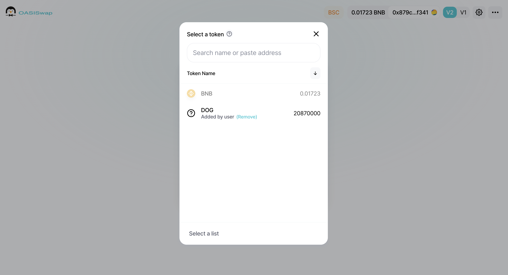
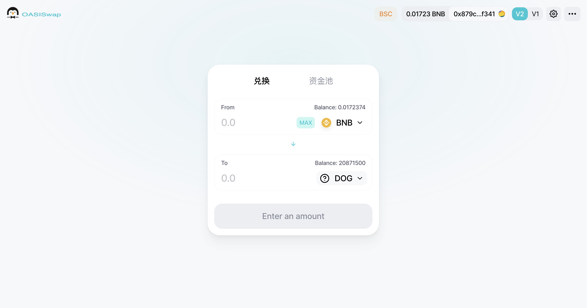
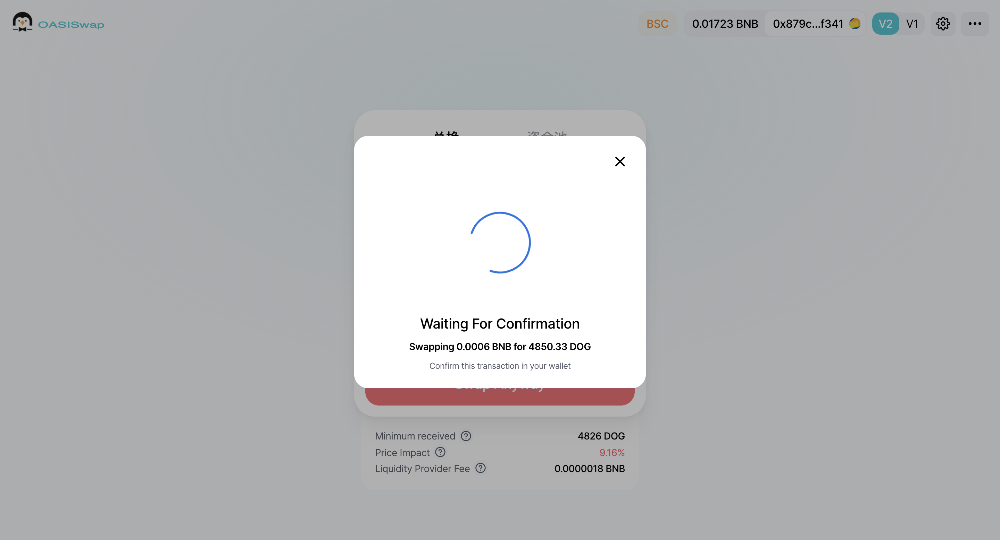
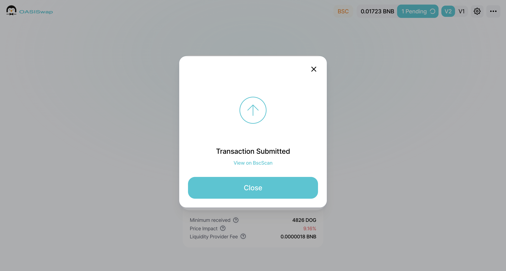

# How to swap

&nbsp;
 

 
   
 
    
 
     
 
      

       Start Swap Now.
      
 
      
Go to the <strong>OASISwap</strong> page. Clike Here: <Strong><a style="color: #2dc26b;" href="https://app.oasiswap.finance" target="_blank" rel="noopener">https://app.oasiswap.finance</a></Strong>
 
      
 
       
 
        <figure class="reset-3c756112--figure-c0d4b308" contenteditable="false" data-key="e6d6e06abfb7491ebba17bf672281613"> 
         
 
          

           
          
 
         
 
         

          &nbsp;
         
 
        </figure> 
       
 
      
 
      
Copy <strong>Oasiswap Hosted list link</strong>: 
 
      
<a style="color: #2dc26b;" href="https://token.oasiswap.finance/oasiswap-hosted-list.json">https://token.oasiswap.finance/oasiswap-hosted-list.json</a>
 
      
<strong>Hosted list Can help you avoid being deceived by the token of malicious contract code!</strong>
 
      
Then paste to &quot;<strong>Add list</strong>&quot;
 
      
&nbsp;
 
      
 
       
 
        <figure class="reset-3c756112--figure-c0d4b308" contenteditable="false" data-key="e6d6e06abfb7491ebba17bf672281613"> 
         
 
          

           
          
 
         
 
         

          &nbsp;
         
 
        </figure> 
       
 
      

      
&nbsp;
 
      
Find the two tokens you want to trade (you can also <strong>search for the pass name</strong> or <strong>paste the pass contract address</strong> to find it).
 
      
 
       
 
        <figure class="reset-3c756112--figure-c0d4b308" contenteditable="false" data-key="61aad051f7774157a976ea08b315150f"> 
         
 
          

           
          
 
         
 
         

          &nbsp;
         
 
        </figure> 
       
 
      
 
      
Enter the number of transactions and click on <strong class="bold-3c254bd9" data-slate-leaf="true">Swap</strong>.
 
      
 
       
 
        <figure class="reset-3c756112--figure-c0d4b308" contenteditable="false" data-key="4664432546e642e8807f4aae87dd6709"> 
         
 
          

           
          
 
         
 
         

          &nbsp;
         
 
        </figure> 
       
 
      
 
      
In the MetaMask pop-up window, click <strong class="bold-3c254bd9" data-slate-leaf="true">Confirm</strong>.
 
      
 
       
 
        <figure class="reset-3c756112--figure-c0d4b308" contenteditable="false" data-key="549a9c20a4154d51b57bfae9993385c9"> 
         
 
          

           
          
 
         
 
         

          &nbsp;
         
 
        </figure> 
       
 
      
 
      
Wait for the transaction to complete and the token is redeemed successfully.
 
      
 
       
 
        <figure class="reset-3c756112--figure-c0d4b308" contenteditable="false" data-key="ff788d26a6cb4d369784123a0c70e16c"> 
         
 
          

           
          
 
         
 
         

          &nbsp;
         
 
        </figure> 
       
 
      
 
     
 
    
 
   
 
  
 
  
 
   
 
    
 
     

      &nbsp;
     
 
     

      &nbsp;
     
 
    
 
   
 

  