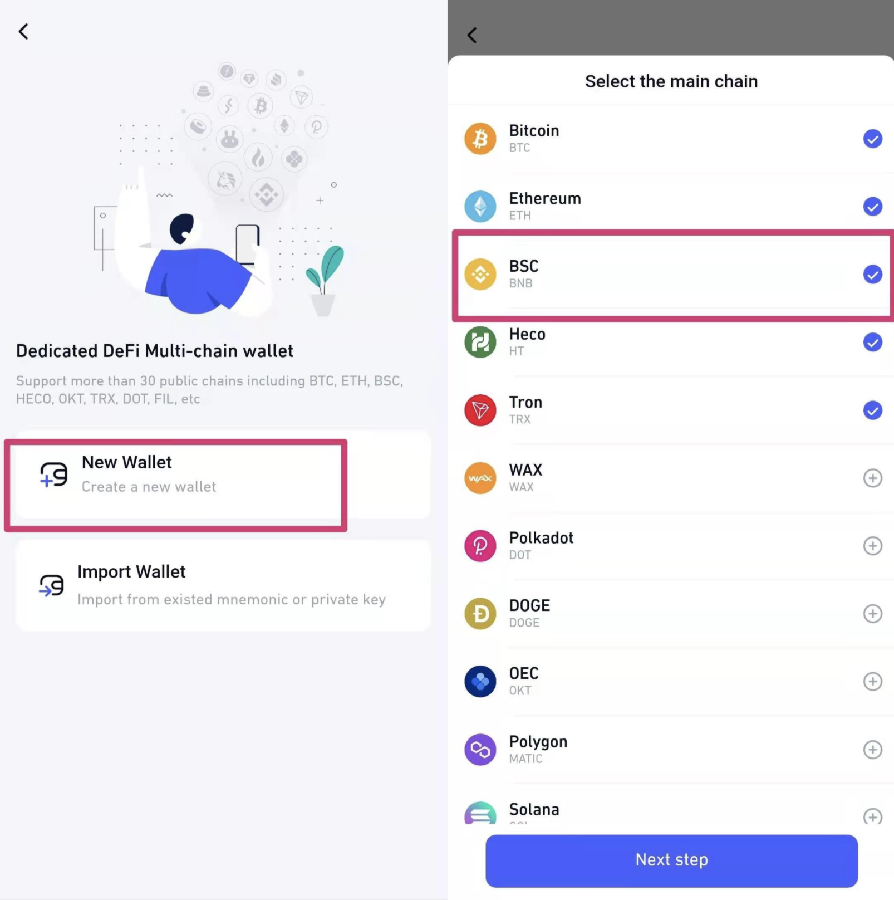
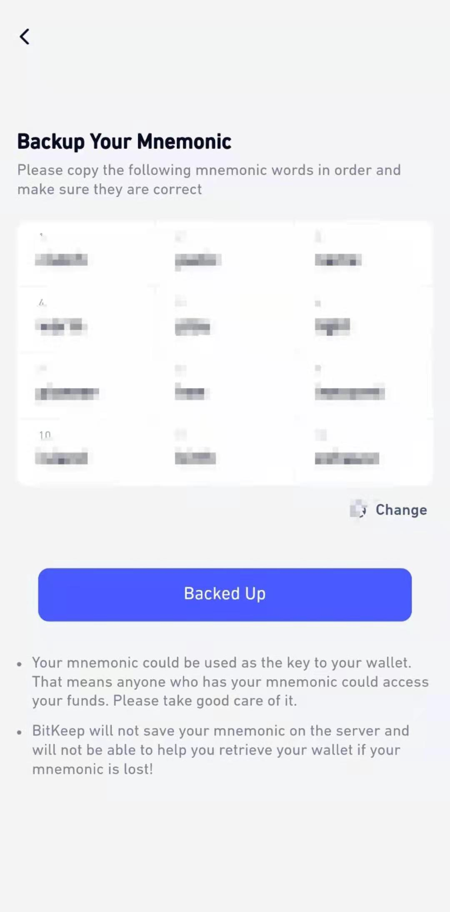
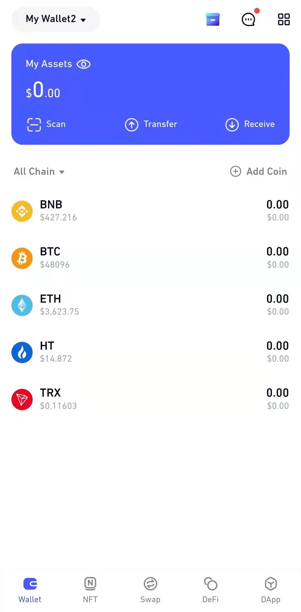
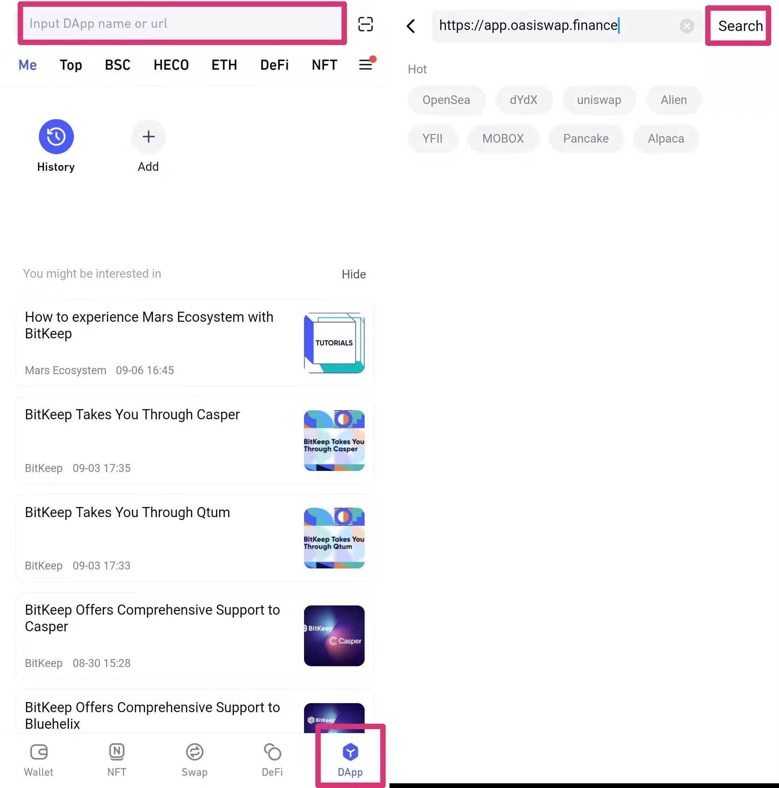
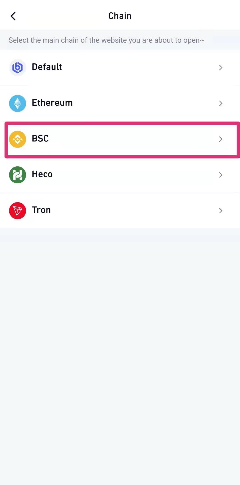
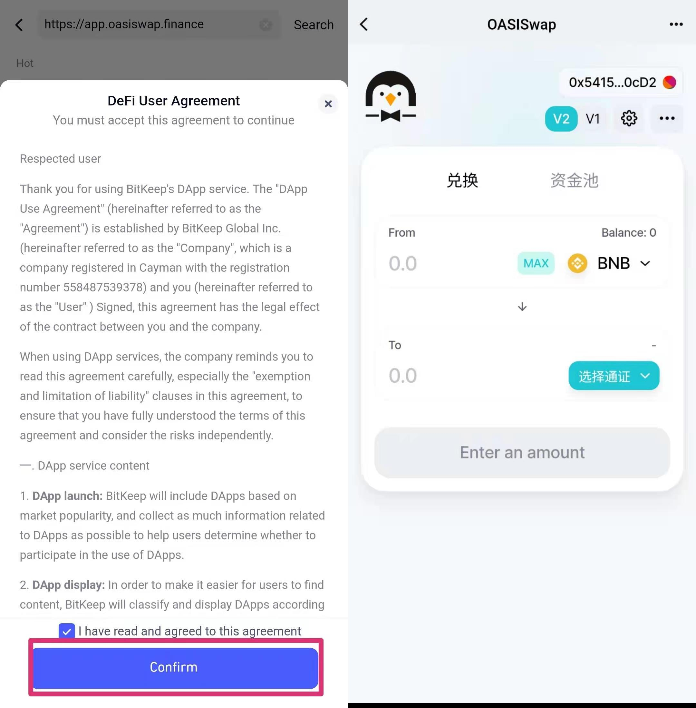

# Bitkeep

&nbsp;

 
   
 
    
 
     
 
      <h1 class="blockHeadingContent-756c9114">1. Download BitKeep Wallet</h1> 
      
Visit BitKeep wallet official website and download App. (Address:<strong><a class="link-a079aa82--primary-53a25e66--link-faf6c434" style="color: #2dc26b;" href="https://bitkeep.org/" target="_blank" rel="noopener noreferrer" data-key="bde8f389ddca47779cd840d8faa5ee6c">https://bitkeep.org</a></strong>)
 
      
 
       
 
        <figure class="reset-3c756112--figure-c0d4b308" contenteditable="false" data-key="1b40d4c65def47ba8c4181c055bf382e"> 
         
 
          

           
          
 
         
 
         

          &nbsp;
         
 
        </figure> 
       
 
      
 
      
Open the bitkeep wallet after installation.
 
      <h2 class="blockHeadingContent-756c9114">2. Connect Wallet</h2> 
      
You can select to create wallet or import existed wallet. Take ‘New Wallet’ as an example. Select <strong class="bold-3c254bd9" data-slate-leaf="true">New Wallet</strong>，choose the right chain, check <strong>BSC</strong>, click <strong class="bold-3c254bd9" data-slate-leaf="true">Next step</strong>.
 
      
 
       
 
        <figure class="reset-3c756112--figure-c0d4b308" contenteditable="false" data-key="dd8e401ca18d4d659e0c9d442e62eb4f"> 
         
 
          

           
          
 
         
 
         

          &nbsp;
         
 
        </figure> 
       
 
      
 
      
Back up mnemonics and verify mnemonics as required.
 
      
 
       
 
        <figure class="reset-3c756112--figure-c0d4b308" contenteditable="false" data-key="37e11a5aedda4e388f5478130e41e855"> 
         
 
          

           
          
 
         
 
         

          &nbsp;
         
 
        </figure> 
       
 
      
 
      
After verification, the wallet is created successfully.
 
      
 
       
 
        <figure class="reset-3c756112--figure-c0d4b308" contenteditable="false" data-key="e0189b0605994a1f84e4ec0edbeb59fe"> 
         
 
          

           
          
 
         
 
         

          &nbsp;
         
 
        </figure> 
       
 
      
 
      <h2 class="blockHeadingContent-756c9114">3. Start the Journey with Oasiswap</h2> 
      
On the <strong class="bold-3c254bd9" data-slate-leaf="true">DApp</strong> page, click the search box at the top of the page and enter the KSwap : <strong><a class="link-a079aa82--primary-53a25e66--link-faf6c434" style="color: #2dc26b;" href="https://app.oasiswap.finance" target="_blank" rel="noopener" data-key="15f8e193f9394910a7dd12c3a0330050">https://app.oasiswap.finance</a></strong> and search.
 
      
 
       
 
        <figure class="reset-3c756112--figure-c0d4b308" contenteditable="false" data-key="3ac44c2eb16049539daf5cf218f8f01a"> 
         
 
          

           
          
 
         
 
         

          &nbsp;
         
 
        </figure> 
       
 
      
 
      
Select <strong class="bold-3c254bd9" data-slate-leaf="true">Binance Smart Chain</strong>.
 
      
 
       
 
        <figure class="reset-3c756112--figure-c0d4b308" contenteditable="false" data-key="8995bbb5b11e4d5da1191990564746e6"> 
         
 
          

           
          
 
         
 
         

          &nbsp;
         
 
        </figure> 
       
 
      
 
      
When you open it for the first time, a risk statement will pop up. After reading it, select <strong class="bold-3c254bd9" data-slate-leaf="true">Confirm</strong> and you can start with Oasiswap.
 
      
 
       
 
        <figure class="reset-3c756112--figure-c0d4b308" contenteditable="false" data-key="320a0d69f5904be8846acc22dea0e8e9"> 
         
 
          

           
          
 
         
 
         

          &nbsp;
         
 
        </figure> 
       
 
      
 
     
 
    
 
   
 
  
 
  
 
   
 
    
 
     

      &nbsp;
     
 
     

      &nbsp;
     
 
    
 
   
 

