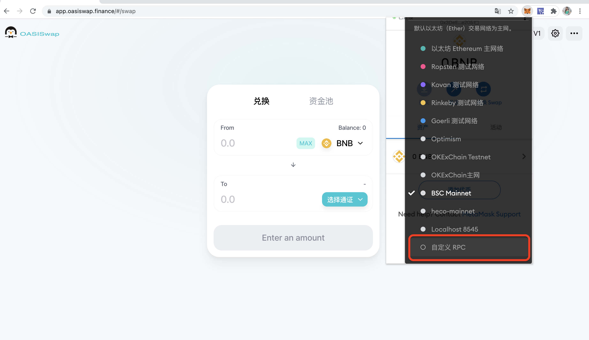
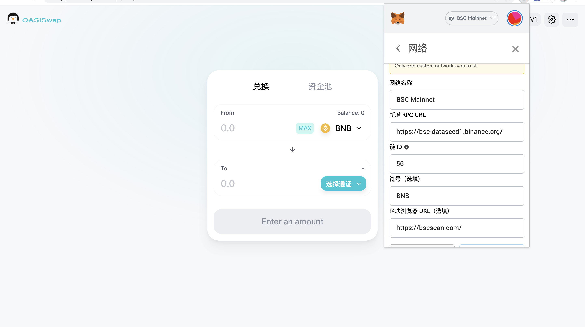
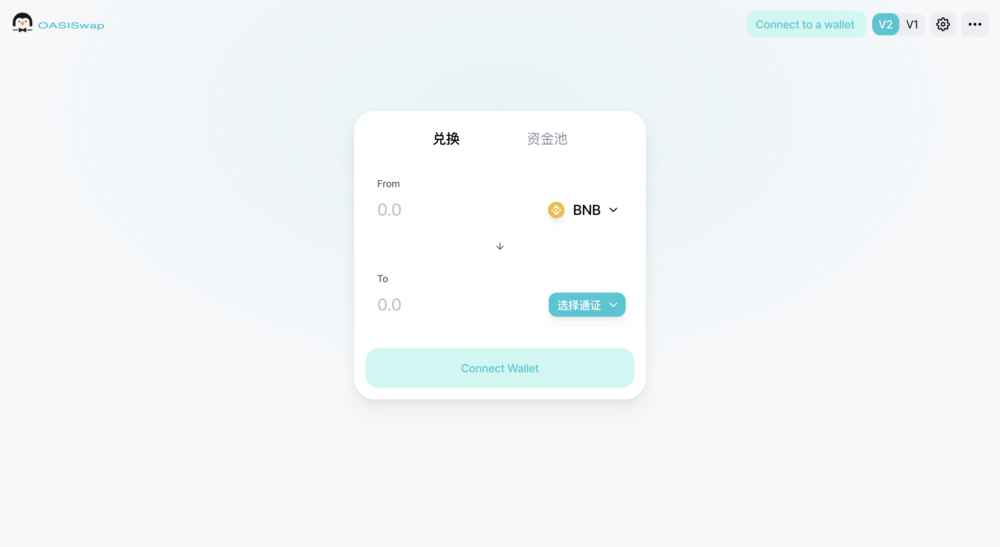
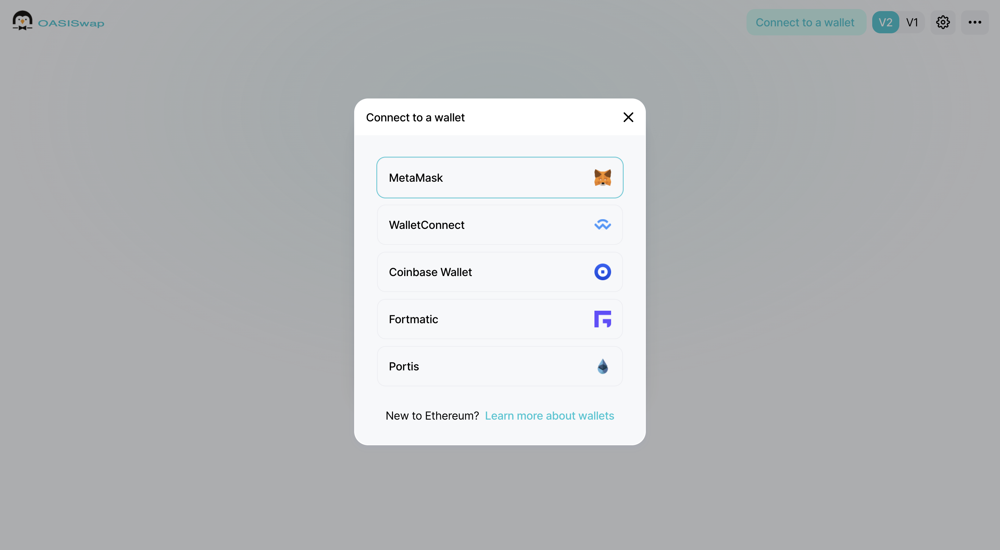
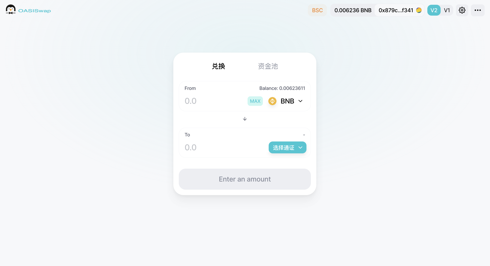

# MetaMask

&nbsp;

 
   
 
    
 
     
 
      <h2 class="blockHeadingContent-756c9114">1. Install MetaMask Wallet From Chrome.</h2> 
      
MetaMask website: <strong><a class="link-a079aa82--primary-53a25e66--link-faf6c434" style="color: #2dc26b;" href="https://metamask.io/" target="_blank" rel="noopener noreferrer" data-key="0703918cf6ce4c8f98a7a3162bc441de">https://metamask.io</a></strong>​
 
      
 
       
 
        <figure class="reset-3c756112--figure-c0d4b308" contenteditable="false" data-key="3c4de3b6863d41d6ae123d05590be7b2"> 
         
 
          

           
          
 
         
 
         

          &nbsp;
         
 
        </figure> 
       
 
      
 
      
In Chrome, for example, download and install the MetaMask Wallet plugin in the Chrome online app store.
 
      
Download address: <strong><a class="link-a079aa82--primary-53a25e66--link-faf6c434" style="color: #2dc26b;" href="https://chrome.google.com/webstore/detail/metamask/nkbihfbeogaeaoehlefnkodbefgpgknn" target="_blank" rel="noopener noreferrer" data-key="c61e00ef680f4c0db4f2c9175084d1a9">https://chrome.google.com/webstore/detail/metamask/nkbihfbeogaeaoehlefnkodbefgpgknn</a></strong>​
 
      
 
       
 
        <figure class="reset-3c756112--figure-c0d4b308" contenteditable="false" data-key="3193ff39c34043fe824f8f128eb7c986"> 
         
 
          

           
          
 
         
 
         

          &nbsp;
         
 
        </figure> 
       
 
      
 
      
Once installed, open MetaMask.
 
      
By default, the wallet is connected to the Ethereum Mainnet, click on the <strong class="bold-3c254bd9" data-slate-leaf="true">Ethereum Mainnet</strong>, and in the drop-down menu, click on Custom RPC:
 
      
 
       
 
        <figure class="reset-3c756112--figure-c0d4b308" contenteditable="false" data-key="6341b717b4734d67b9edc269e2910760"> 
         
 
          

           
          
 
         
 
        </figure> 
       
 
      
 
      
Fill in the BSC Mainnet RPC data in the form: 
 
      
 
       
 
        
 
         
 
          
 
           

            &nbsp;
           
 
           
 
            

             Mainnet RPC
            
 
           
 
           

            &nbsp;
           
 
          
 
         
 
        
 
       
 
       
 
        
 
         
 
          
 
           
Networt Name: <strong>BSC Mainnet</strong>
 
           
New RPC URL: <strong>https://bsc-dataseed1.binance.org/</strong>​
 
           
Chain ID: <strong>56</strong>
 
           
Currency Symbol: <strong>BNB</strong>
 
           
Block Explorer URL: <strong>https://bscscan.com/</strong>​
 
          
 
         
 
        
 
       
 
      
 
      
 
       
 
        <figure class="reset-3c756112--figure-c0d4b308" contenteditable="false" data-key="cb0c82f813d84ad2b7f04aafdf2d1f53"> 
         
 
          

           
          
 
         
 
         

          &nbsp;
         
 
        </figure> 
       
 
      
 
      
Once the configuration is complete and saved, switch to that network.
 
      <h2 class="blockHeadingContent-756c9114">2. Use Oasiswap</h2> 
      
Take Swap for example, open the Oasiswap official website: <strong><a class="link-a079aa82--primary-53a25e66--link-faf6c434" style="color: #2dc26b;" href="https://app.oasiswap.finance/" target="_blank" rel="noopener" data-key="b00fbd3d82bd433d83359b8b680a95e9">https://app.oasiswap.finance</a></strong>.
 
      
 
       
 
        <figure class="reset-3c756112--figure-c0d4b308" contenteditable="false" data-key="f3a7a0b8e550465e84a8324985bba04d"> 
         
 
          

           
          
 
         
 
         

          &nbsp;
         
 
        </figure> 
       
 
      
 
      
Click <strong class="bold-3c254bd9" data-slate-leaf="true">Connect to a wallet</strong> in the upper right corner and select <strong class="bold-3c254bd9" data-slate-leaf="true">MetaMask</strong>.
 
      
 
       
 
        <figure class="reset-3c756112--figure-c0d4b308" contenteditable="false" data-key="633ebf73a2f44accb30e30dd1f77c1b4"> 
         
 
          

           
          
 
         
 
         

          &nbsp;
         
 
        </figure> 
       
 
      
 
      
Once connected, you can use Oasiswap.
 
      
 
       
 
        <figure class="reset-3c756112--figure-c0d4b308" contenteditable="false" data-key="a57305d1bafa4a5f886204b3347ca9ec"> 
         
 
          

           
          
 
         
 
         

          &nbsp;
         
 
        </figure> 
       
 
      
 
     
 
    
 
   
 
  
 
  
 
   
 
    
 
     

      &nbsp;
     
 
     

      &nbsp;
     
 
    
 
   
 

  
