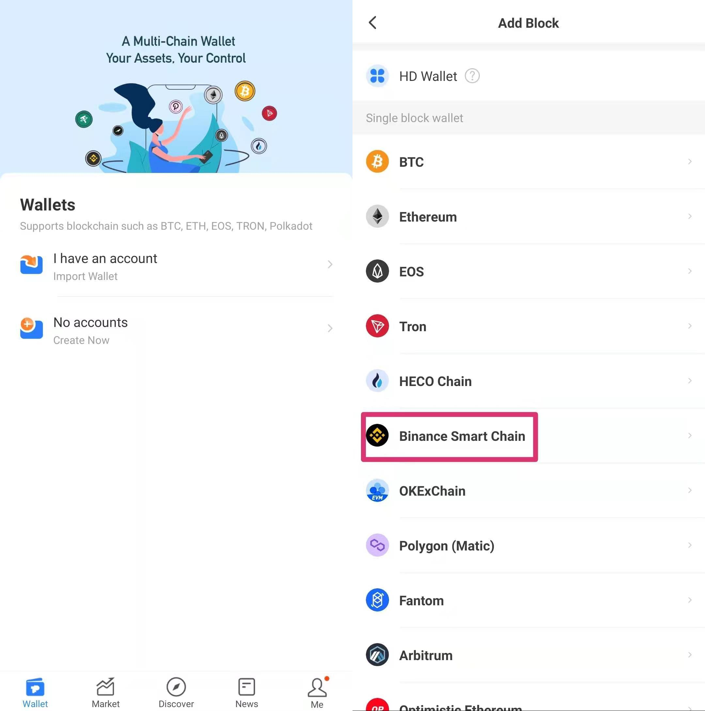
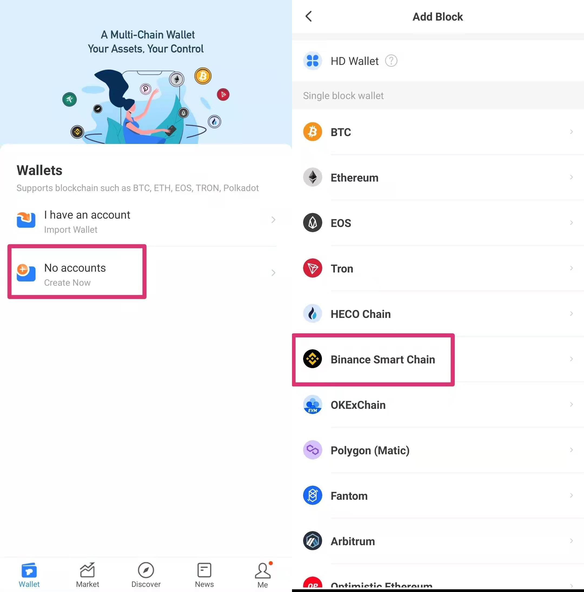
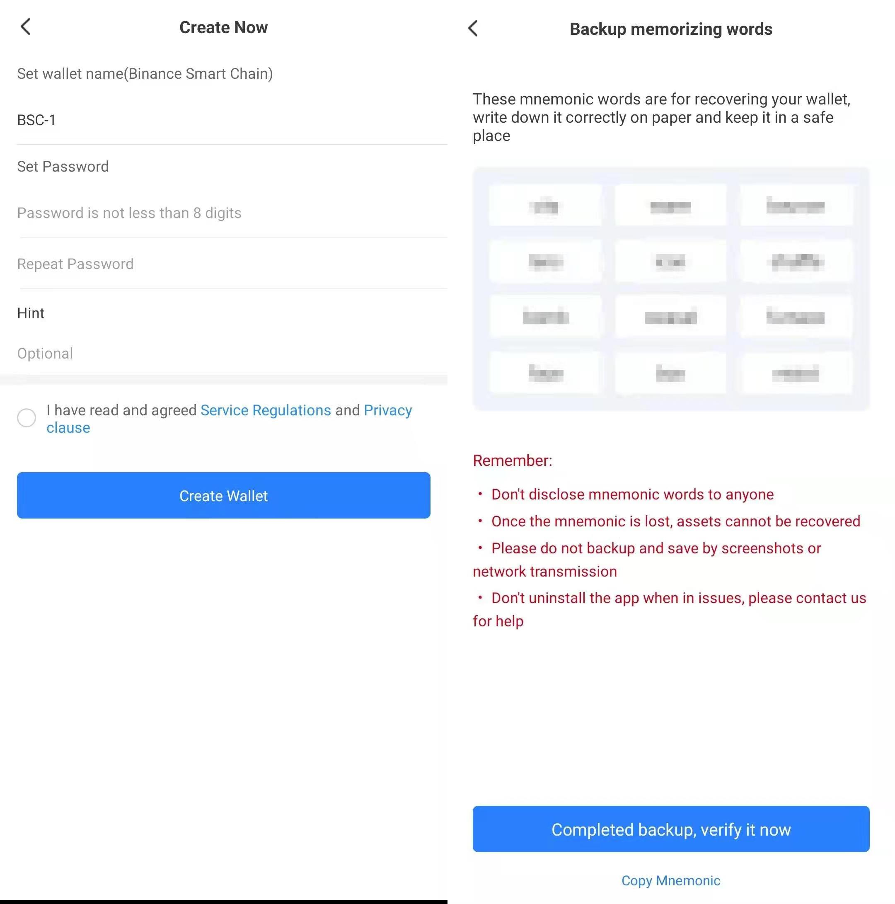
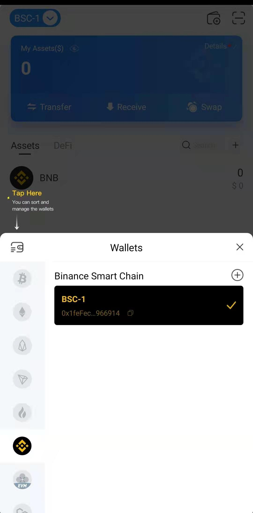
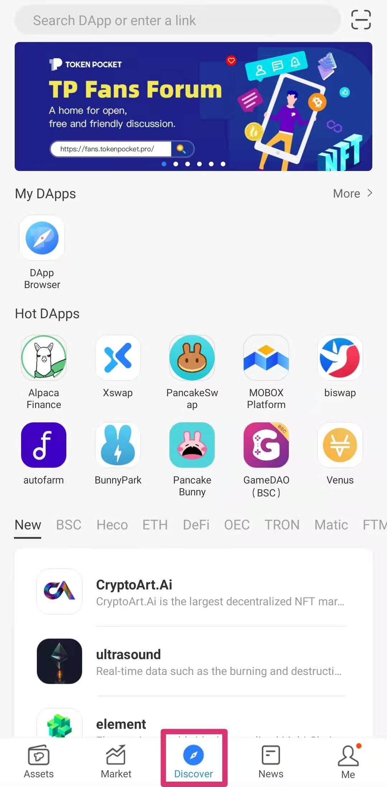
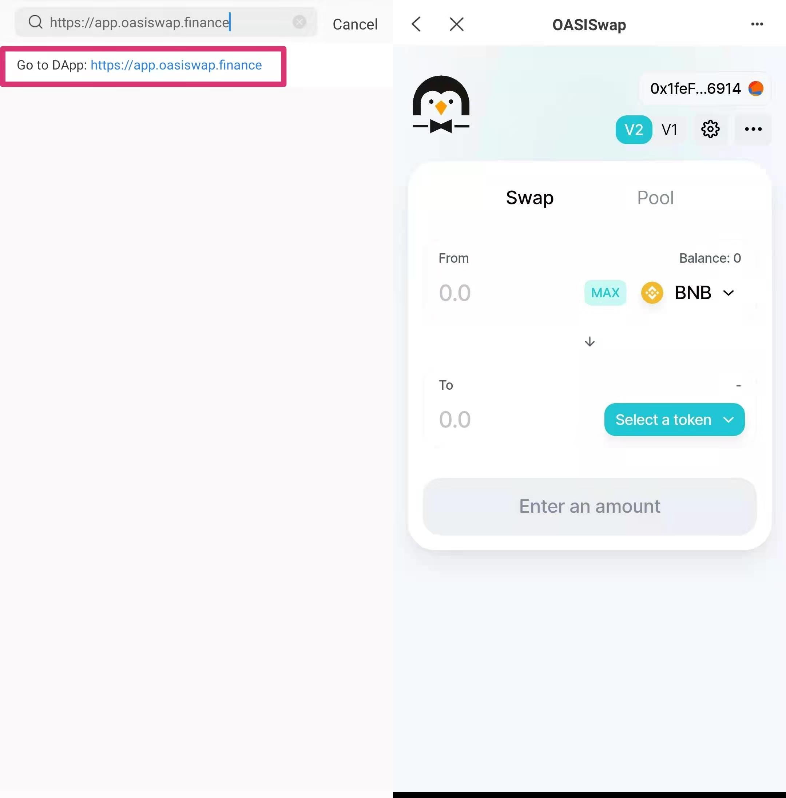

# TokenPocket

&nbsp;

<h2 class="blockHeadingContent-756c9114">1. Download TP wallet</h2>

Visit TokenPocket wallet official website to download <a class="link-a079aa82--primary-53a25e66--link-faf6c434" href="https://www.tokenpocket.pro/" target="_blank" rel="noopener noreferrer" data-key="2107616d843043aba149172acc707d03"><strong>https://www.tokenpocket.pro</strong></a>.

<figure class="reset-3c756112--figure-c0d4b308" contenteditable="false" data-key="96d4b04ad7284af7a6e9e3bf83ca5cc4">

&nbsp;

</figure>

Install and then open TP wallet.

<h2 class="blockHeadingContent-756c9114">2. Connect Wallet</h2>

If you already have a TP wallet, you can choose to import wallet, select <strong class="bold-3c254bd9" data-slate-leaf="true">Binance Smart Chain.</strong>

<figure class="reset-3c756112--figure-c0d4b308" contenteditable="false" data-key="585560bb0a0644ae8ed6e50535dcf1da">

&nbsp;

</figure>

You could also choose private key import，mnemonic words or keystore three ways.

​

If you don&rsquo;t have a TP wallet, you could choose to create one, select <strong class="bold-3c254bd9" data-slate-leaf="true">Binance Smart Chain</strong><strong class="bold-3c254bd9" data-slate-leaf="true">.</strong>

<figure class="reset-3c756112--figure-c0d4b308" contenteditable="false" data-key="b1c9c5d43c9c49388c6e900b64391db7">

&nbsp;

</figure>

Set up the name of your wallet, code etc., and please be sure to keep your mnemonic words safe.

<figure class="reset-3c756112--figure-c0d4b308" contenteditable="false" data-key="1cdb7880d9c64874a1864c94e58d46e9">

&nbsp;

</figure>

 Go to the main wallet page and switch to <strong class="bold-3c254bd9" data-slate-leaf="true">Binance Smart Chain</strong>&nbsp;wallet.

<figure class="reset-3c756112--figure-c0d4b308" contenteditable="false" data-key="d79993af7c1b42ee83b6a2319524c802">

&nbsp;

</figure>

<h2 class="blockHeadingContent-756c9114">3. Use KSwap</h2>

Open your TP wallet, click <strong class="bold-3c254bd9" data-slate-leaf="true">Discover</strong> page. Click <strong class="bold-3c254bd9" data-slate-leaf="true">Search box.</strong>

<figure class="reset-3c756112--figure-c0d4b308" contenteditable="false" data-key="b76b1a1f00e24e1eba36e0d6da15d5c0">

&nbsp;

</figure>

Input KSwap website: <strong><a class="link-a079aa82--primary-53a25e66--link-faf6c434" style="color: #2dc26b;" href="https://app.oasiswap.finance/" target="_blank" rel="noopener" data-key="138a7600dc6f4e86b2e154e6c6fa1a7e">https://app.oasiswap.finance</a></strong> and go to it, then you can use KSwap.

<figure class="reset-3c756112--figure-c0d4b308" contenteditable="false" data-key="f0da0a474c5a44a290f32ea6e0c1bcd6">

&nbsp;

</figure>

&nbsp;

&nbsp;

